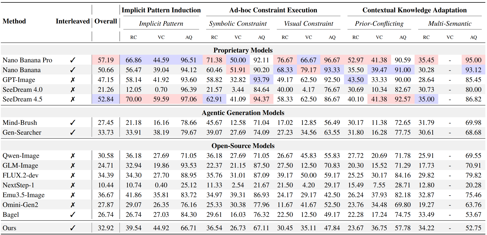

<div align="center">
<h1>
🧠 GENIUS: Generative Fluid Intelligence Evaluation Suite
</h1>

[](https://arxiv.org/pdf/2602.11144) [](https://huggingface.co/datasets/HankYang428/GENIUS) 

</div>

<div align="center">

[Ruichuan An](https://github.com/arctanxarc)<sup>\*</sup>, [Sihan Yang](https://github.com/Hhankyangg)<sup>*</sup>, [Ziyu Guo](), [Wei Dai](), [Zijun Shen](), [Haodong Li]() <br> [Renrui Zhang]()<sup>†</sup>, [Xinyu Wei](), [Guopeng Li](), [Wenshan Wu](), [Wentao Zhang]()<sup>‡</sup>

PKU, CUHK, StepFun, PolyU, MSRA.

<sup>*</sup> Equal Contribution &nbsp;&nbsp;&nbsp; <sup>†</sup> Project Leader &nbsp;&nbsp;&nbsp; <sup>‡</sup> Corresponding Author

</div>

<p align="center">
  <a href="https://chawuciren11.github.io/GENIUS/"><b>📄 Blog</b></a> |
  <a href="#-quick-start"><b>🚀 Quick Start</b></a> |
  <a href="#1-download-the-test-dataset"><b>📦 Dataset</b></a> |
  <a href="#-license"><b>📜 License</b></a> |
  <a href="#-citation"><b>📝 Citation</b></a> |
  <a href="#-contact"><b>📬 Contact</b></a>
</p>


---

## 🕙 Timeline
- [x] **2026.02.11**: 🌟 Release of the evaluation code and the core test dataset.
- [ ] **TBD**: Integration of more model inference scripts.

---

## 🏆 Leaderboard


---

## 🚀 Quick Start

### 1. Download the Test Dataset
The dataset is available across multiple platforms for your convenience:

* **Hugging Face**: [GENIUS](https://huggingface.co/datasets/HankYang428/GENIUS)
* **Google Drive**: [Download Link](https://drive.google.com/file/d/1NAE1nGbYOrvGvimzSCoDVNebvBdGdIpg/view?usp=drive_link)
* **Baidu Netdisk**: [Download Link](https://pan.baidu.com/s/1ON_ryhfzYHQNzex1gEjCGQ?pwd=iek1) (Password: `iek1`)

### 2. Installation & Directory Setup
Clone the repository and prepare your local environment:

```bash
git clone https://github.com/arctanxarc/GENIUS.git
cd GENIUS
```

After downloading the dataset, ensure your directory structure matches the following:
```text
./
├── cal_score.py           # Scoring script
├── dataset/               # Test dataset
│   ├── implicit_pattern
│   ├── multi_semantic
│   ├── prior_conflicting
│   ├── symbolic_constraint
│   └── visual_constraint
├── eval_prompt.py         # Prompt management
├── eval.py                # Main evaluation logic
├── eval.sh                # Entry script
├── GENIUS.pdf             # Paper
└── README.md
```

### 3. Prepare Model Outputs

Place the images generated by your models into the `outputs` directory. Organize them using the following hierarchy: `outputs/<model_name>/<task_name>/{id}.png`.

> [!IMPORTANT]
>
> The `{id}` must correspond strictly to the id field in `test_data.json` (Note: IDs are unique identifiers, not necessarily a continuous sequence starting from 0).

Example Structure:
```text
./
./outputs/
└── nanobanana/              # Example: Model Name
    ├── implicit_pattern/
    │   ├── 002.png          # Matches ID=002 in ./dataset/implicit_pattern/test_data.json
    │   ├── 003.png
    │   └── ...
    ├── multi_semantic/
    └── ...
```

### 4. Running the Evaluation

Configure your credentials and target models in eval.sh:

1. Set your `API_URL` and `API_KEY` for LMM-as-a-judge.
2. Define the evaluation scope:
```shell
DIMENSIONS=("implicit_pattern" "symbolic_constraint" "visual_constraint" "prior_conflicting" "multi_semantic")
MODELS=("your_model_name")
```
3. Execute the evaluation script:
```shell
bash eval.sh
```

## 📜 License

The dataset and code are released under **CC-BY-NC 4.0** and are intended for academic research **only**. Commercial use is not permitted.

## 📝 Citation

```text
@misc{an2026geniusgenerativefluidintelligence,
      title={GENIUS: Generative Fluid Intelligence Evaluation Suite}, 
      author={Ruichuan An and Sihan Yang and Ziyu Guo and Wei Dai and Zijun Shen and Haodong Li and Renrui Zhang and Xinyu Wei and Guopeng Li and Wenshan Wu and Wentao Zhang},
      year={2026},
      eprint={2602.11144},
      archivePrefix={arXiv},
      primaryClass={cs.LG},
      url={https://arxiv.org/abs/2602.11144}, 
}
```

## 📬 Contact

* Issues: [https://github.com/arctanxarc/GENIUS/issues](https://github.com/arctanxarc/GENIUS/issues)
* Email: [arctanxarc@gmail.com](mailto:arctanxarc@gmail.com)
